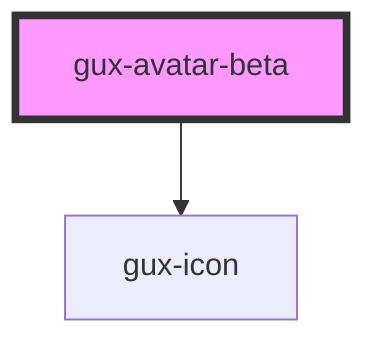

# gux-card-beta

<!-- Auto Generated Below -->

## Properties

| Property      | Attribute     | Description | Type                                                                                                | Default       |
| ------------- | ------------- | ----------- | --------------------------------------------------------------------------------------------------- | ------------- |
| `badge`       | `badge`       |             | `boolean`                                                                                           | `false`       |
| `initials`    | `initials`    |             | `string`                                                                                            | `undefined`   |
| `interactive` | `interactive` |             | `boolean`                                                                                           | `false`       |
| `size`        | `size`        |             | `"large" \| "medium" \| "small" \| "xsmall"`                                                        | `'large'`     |
| `status`      | `status`      |             | `"available" \| "break" \| "busy" \| "notifications" \| "off queue" \| "online" \| "out of office"` | `'available'` |
| `statusRing`  | `status-ring` |             | `boolean`                                                                                           | `false`       |

## Slots

| Slot      | Description     |
| --------- | --------------- |
| `"image"` | Headshot photo. |

## Dependencies

### Depends on

- [gux-icon](../../stable/gux-icon)

### Graph

----------------------------------------------

*Built with [StencilJS](https://stenciljs.com/)*
