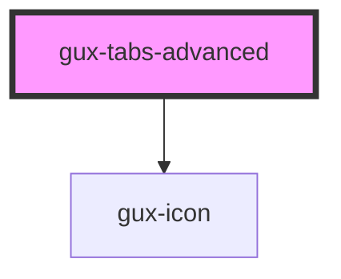

# gux-tabs-advanced

<!-- Auto Generated Below -->

## Properties

| Property           | Attribute             | Description                         | Type      | Default     |
| ------------------ | --------------------- | ----------------------------------- | --------- | ----------- |
| `activeTab`        | `active-tab`          | tabId of the currently selected tab | `string`  | `undefined` |
| `allowSort`        | `allow-sort`          | Enable tab sorting by drag/drop     | `boolean` | `true`      |
| `showNewTabButton` | `show-new-tab-button` | Enable new tab button               | `boolean` | `true`      |
| `tabLimit`         | `tab-limit`           | Maximum number of tabs created      | `number`  | `Infinity`  |

## Events

| Event                | Description                                   | Type                  |
| -------------------- | --------------------------------------------- | --------------------- |
| `guxactivetabchange` | Triggers when the active tab changes.         | `CustomEvent<string>` |
| `newTab`             | Triggers when the new tab button is selected. | `CustomEvent<any>`    |

## Methods

### `guxActivate(tabId: string) => Promise<void>`

#### Returns

Type: `Promise<void>`

### `guxSetActive(activeTab: string) => Promise<void>`

#### Returns

Type: `Promise<void>`

## Slots

| Slot         | Description                                   |
| ------------ | --------------------------------------------- |
|              | collection of gux-tab-advanced-panel elements |
| `"tab-list"` | Slot for gux-tab-advanced-list element        |

## Dependencies

### Depends on

- [gux-icon](../gux-icon)

### Graph

----------------------------------------------

*Built with [StencilJS](https://stenciljs.com/)*
