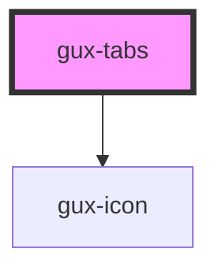

# gux-tabs

<!-- Auto Generated Below -->

## Properties

| Property    | Attribute    | Description                                          | Type                                | Default     |
| ----------- | ------------ | ---------------------------------------------------- | ----------------------------------- | ----------- |
| `activeTab` | `active-tab` | tabId of the currently selected tab                  | `string`                            | `undefined` |
| `alignment` | `alignment`  | Specifies left aligned, centered, or full width tabs | `"center" \| "fullWidth" \| "left"` | `'left'`    |

## Events

| Event                | Description                           | Type                  |
| -------------------- | ------------------------------------- | --------------------- |
| `guxactivetabchange` | Triggers when the active tab changes. | `CustomEvent<string>` |

## Methods

### `guxActivate(tabId: string) => Promise<void>`

#### Returns

Type: `Promise<void>`

## Slots

| Slot         | Description                          |
| ------------ | ------------------------------------ |
|              | collection of gux-tab-panel elements |
| `"tab-list"` | Slot for gux-tab-list                |

## Dependencies

### Depends on

- [gux-icon](../gux-icon)

### Graph

----------------------------------------------

*Built with [StencilJS](https://stenciljs.com/)*
