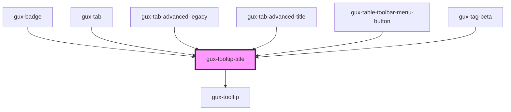

# gux-title-tooltip

<!-- Auto Generated Below -->

## Methods

### `setHideTooltip() => Promise<void>`

#### Returns

Type: `Promise<void>`

### `setShowTooltip() => Promise<void>`

#### Returns

Type: `Promise<void>`

## Dependencies

### Used by

 - [gux-badge](../gux-badge)
 - [gux-tab](../gux-tabs/gux-tab)
 - [gux-tab-advanced-legacy](../../legacy/gux-tabs-advanced-legacy/gux-tab-advanced-legacy)
 - [gux-tab-advanced-title](../gux-tabs-advanced/gux-tab-advanced-title)
 - [gux-table-toolbar-menu-button](../gux-table-toolbar/gux-table-toolbar-menu-button)
 - [gux-tag-beta](../../beta/gux-tag)

### Depends on

- [gux-tooltip](../gux-tooltip)

### Graph

----------------------------------------------

*Built with [StencilJS](https://stenciljs.com/)*
